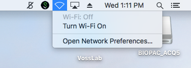
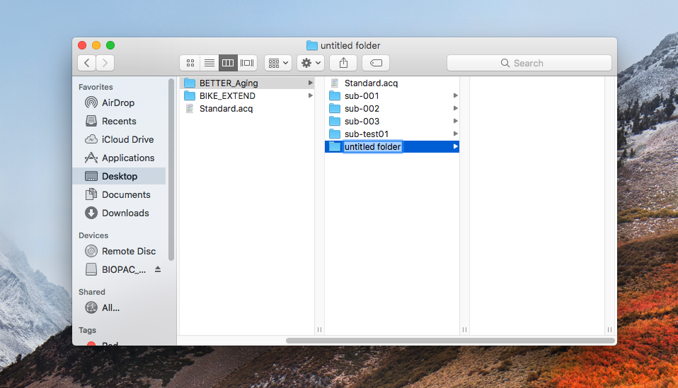
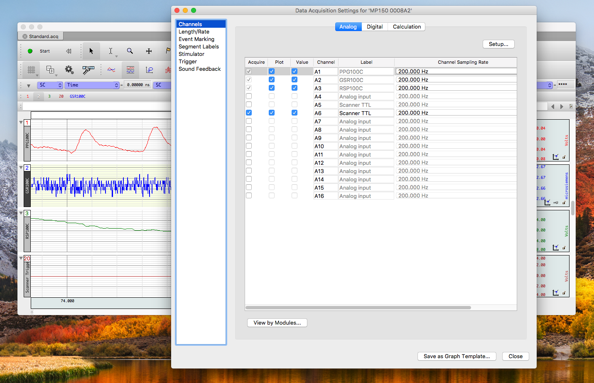

# Collecting/Uploading Physio Data
This manual walks through collecting and uploading physiological data (heart rate and respiration).
The data will be saved using a [bid(ish) format](http://bids.neuroimaging.io/#download).
Please gain familiarity with bids if you plan on helping with data collection/working with data; it's pretty great.

## Naming References
Shortcut if you know what steps to take, but forgot how to name the files
### bids naming templates:
- raw acq files
    - `sub-<label>_ses-<label>_acq-`
- txt file output (after raw data collection)
    - `sub-<label>_ses-<label>_task-<label>(_run-<label>)_physio`
        - the parens around run mean this key-value pair is optional

`<label>` is any alphanumberic combination, but in BETTER_Aging, and BIKE_EXTEND, we will have predictable names.

#### Bike Extend
- `sub-<label>`
    - Four digit integer above 2000 (e.g. 2001)
- `ses-<label>`
    - day1pre
    - day1post
    - day2pre
    - day2post
    - postintervention
- `task-<label>(_run-<label>)`
    - rest (1, 2, 3)
    - breathhold

#### Better Aging
- `sub-<label>`
    - Three digit zero-padded number (e.g. 002, 015, 120)
- `ses-<label>`
    - pre
    - post
- `task-<label>(_run-<label>)`
    - rest (1, 2)
    - taskswitch
- **Examples**
    - valid: `sub-004_ses-pre_task-rest_run-1`
        - the first run of rest
    - invalid: `sub-004_ses-pre_task-taskswitch_run-1`
        - there are no other runs of taskswitch, so don't add the run key-label pair
    - valid: `sub-004_ses-pre_task-taskswitch`

## Steps!
The step-by-step guide...

### Prerequsite
Make sure the wifi is turned off.

### Step 1
Open the VossLab folder on the desktop.

### Step 2
Select the project (either BETTER_Aging or BIKE_EXTEND).

### Step 3
Create the subject folder within the project folder.
It should follow the format `sub-<label>`.

### Step 4
Create the session folder within the subject folder.
It should follow the format `ses-<label>`.

### Step 5
At the base of the project folder, open `Standard.acq`.

### Step 6
In the menu bar, select MP150, and from the dropdown select "Set Up Data Acquisition...".

### Step 7
After you select "Set Up Data Acquisition...", you should see a page like this.

### Step 8
Select the Length/Rate tab in the new window.

### Step 9
Click on `File...` (in the selected window not the `file` in the top menu along the top of the screen) and select the session folder you just made as the place to save the data (the folder should be empty).

### Step 10
Rename the file from `Standard.acq` to `sub-<label>_ses-<label>_acq-` (where you replace `<label>` with the appropriate names).
Notice the trailing `-` after `acq`; this is intentional, the program will append a 4 digit number after the `-`.

### Step 11
Select save and this window will pop up, we want incrementing number selected, which should be default.
Select ok to continue.

### Step 12
Test if the file is working correctly by clicking start on the open acknowledge file (which will still have the title `Standard.acq`).
Once you hit start the name of the tab should change to what you named the file with the 4 digit acquisition number.

### Step 13
Working with the MRI technicians, start the recordings before each relevant MRI begins, and stop the recording shortly after each relevant MRI ends

### Step 14
After you've collected the physio data, open all the useful acquisitions (not the test one),
from the session folder into the program.

### Step 15
For each acquisition tab, select "Save As...".

### Step 16
Choose the correct session directory to place the converted physio data.

### Step 17
Rename the file using BIDS conventions following this general template:
`sub-<label>_ses-<label>_task-<label>(_run-<label>)_physio` where the run parameter is optional. (e.g. we need for the rest scans, but not the task scans)

### Step 18
Change saving the file from `.acq` to `*.txt*.csv`.

### Step 19
Select save and you will see another box pop up, select `UNIX (LF)` line endings.

### Step 20
Turn on the wifi to upload the data to github.

### Step 21
Follow the [git directions](https://github.com/HBClab/addGitData/blob/master/README.md) to upload the data.

### Step 22
Turn off the wifi when you are done!

